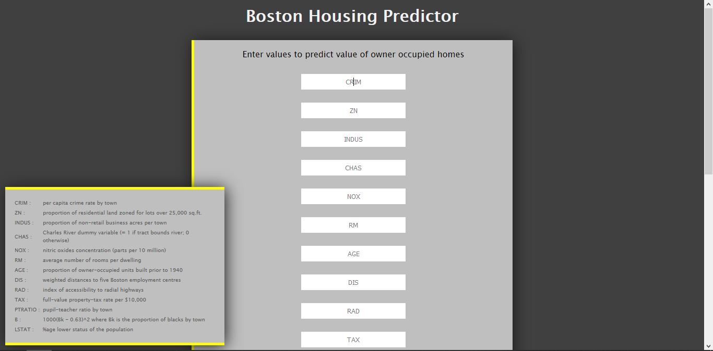

# **Boston Housing Price Prediction 🏡**
### **Machine Learning Model for Predicting Real Estate Prices in Boston**

## **📌 Project Overview**
This project implements a **Machine Learning model** to predict the **median price of owner-occupied homes** in Boston based on **socio-economic and geographical factors**. It utilizes **supervised learning** and is trained on the **Boston Housing Dataset**.

The dataset includes various **features that influence housing prices**, such as:
- **Crime rate (CRIM)**
- **Industrial business concentration (INDUS)**
- **Age of houses (AGE)**
- **Nitrogen Oxide pollution levels (NOX)**
- **Tax rates (TAX)**
- **Proximity to employment centers (DIS)**
- And more...

## **🔍 Use Cases**
### **1️⃣ Real Estate Pricing & Valuation**
- Helps **home buyers & sellers** estimate house prices based on key attributes.
- Assists **real estate agents** in evaluating competitive market pricing.

### **2️⃣ Banking & Loan Risk Assessment**
- **Banks & mortgage lenders** can use this model to assess the **valuation of collateral** before approving home loans.

### **3️⃣ Investment & Market Analysis**
- **Real estate investors** can analyze pricing trends to identify **profitable investment opportunities**.
- **Government planners** can study the impact of socio-economic factors on property value.

### **4️⃣ Smart City Planning**
- **Urban developers** can predict the impact of infrastructure projects on housing prices.
- **Local governments** can use this model for **policy decisions on taxation & zoning laws**.

## **🛠️ Technical Workflow**
The project follows these **machine learning pipeline steps**:

### **1️⃣ Data Preprocessing & Feature Engineering**
- Load dataset from `boston.csv`
- Handle missing values (if any)
- Normalize and scale features for better performance

### **2️⃣ Model Training**
- **Algorithm:** Deep Learning with **Artificial Neural Networks (ANN)**
- **Cross-Validation:** Uses **K-Fold Cross-Validation** (k=10) for evaluation
- **Loss Function:** Mean Squared Error (MSE)
- **Optimizer:** Adam

### **3️⃣ Model Deployment**
- The trained model is **saved** as:
  - `model.json` (Model structure)
  - `model.weights.h5` (Trained model weights)
- Flask API (`api.py`) serves predictions via a **web-based interface**.

## **🚀 Installation & Running the Project**
### **1️⃣ Clone the Repository**

git clone https://github.com/vinuta-patil/boston-housing-price-prediction.git
cd boston-housing-price-prediction

### **2️⃣ Set Up Virtual Environment (Recommended)**

python3 -m venv venv
source venv/bin/activate  # On Mac/Linux
venv\Scripts\activate      # On Window

### **3️⃣ Install Dependencies**
pip install -r requirements.txt

### **4️⃣ Train the Model**
python trainer.py

- Loads dataset (boston.csv)
- Trains the Deep Learning model
- Saves model (model.json, model.weights.h5)

### **5️⃣ Start the API**
python api.py
Runs Flask server at http://127.0.0.1:8001/

### **6️⃣ Access the Web UI**
Open http://127.0.0.1:8001/ in your browser
Enter house details and get a real-time price prediction!
### What you should see

* **bostonIndex.html**

* **predictPage.html**

### Brief of what's happening

* The *index.html* takes in values which are sent to the *api.py* running in the background which does all the prediction.
* *api.py* loads the saved model and sends back the prediction in the Jinja variable (present in the HTML file).
